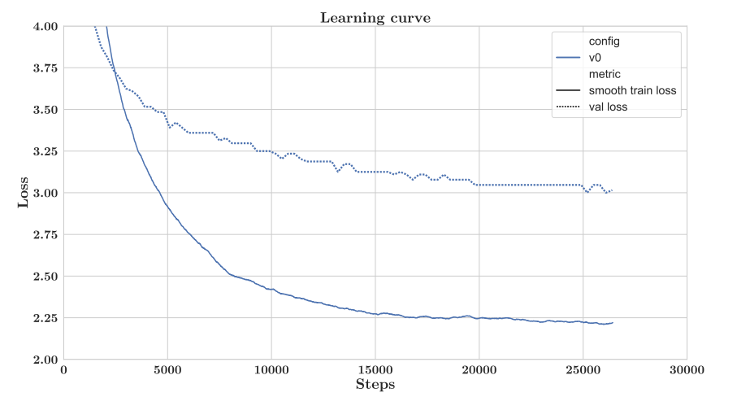
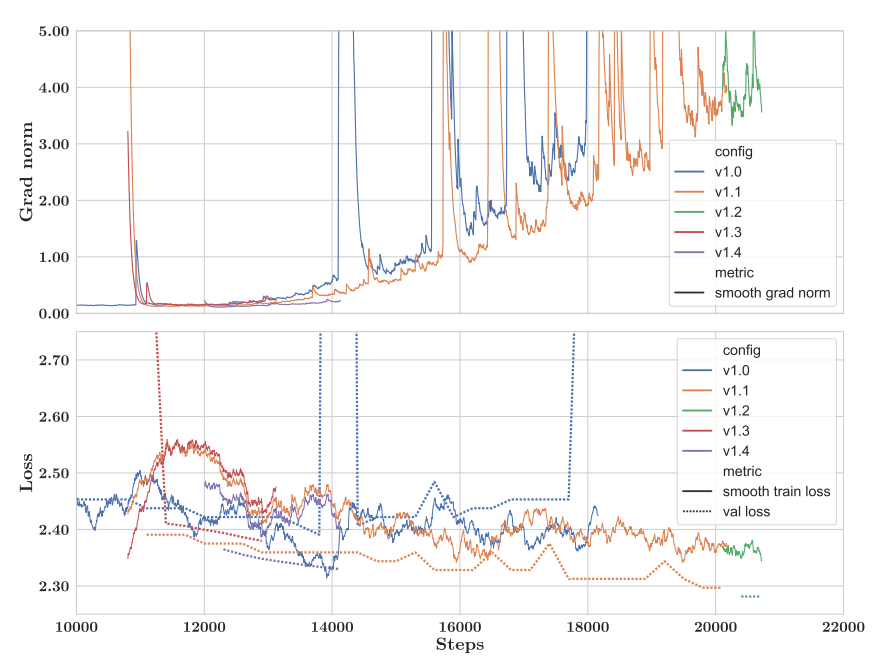
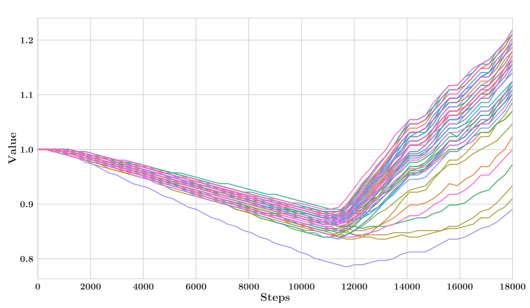
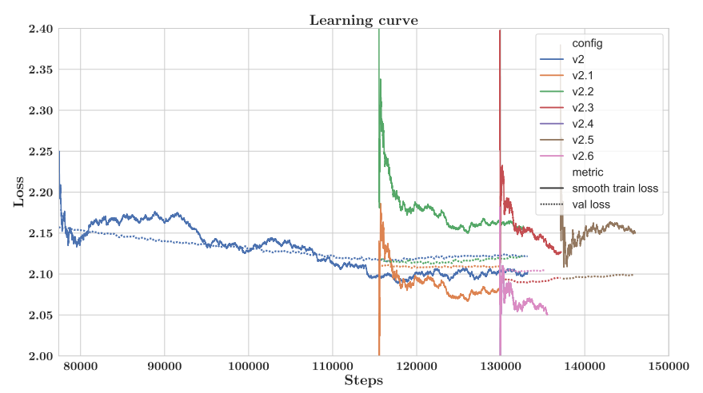

# Bloomberg Loss Divergence Learnings from Training BloombergGPT

##### BloombergGPT, a 50 billion parameter language model, purpose-built for finance and trained on a uniquely balanced mix of standard general-purpose datasets and a diverse array of financial documents from the Bloomberg archives.

### Datatsets
#### Public Data
##### * C4 (Common Crawl)
##### * The Pile - 22 Diverse Domains
##### * Wikipedia from July 2022

#### Private Data
##### * Web Content
##### * News wires and transcripts
##### * SEC Edgars filings
##### * Press Releases

### Major Difference from Other Open Source Model
##### * Removed Embedding layer norm
##### * Tokenizer : [ A-Za-z]+|[0-9]|[^A-Za-z0-9]+. (MultiWord and Numbers Separated into digits)
##### * Chronological Sorted  Datasets (Idea: Newer data should overwrite the older data)

### MAIN CHALLENGES

#### - Training Loss Diverge after 10k steps and There was no improments to dev loss after 20k steps.

#### - Gradient Norm Spikes

#### - LayerNorm at First Layer

#### - After 42 days of smooth run, the validaton performance start to degrade

## SOLUTIONS THAT DID NOT WORK

### Chronological Sorted Datasets 
### Curriculum Learning: Paper: https://arxiv.org/abs/2101.10382
#####  The large gap between training and validation losses, as depicted in the above curve, indicated that validation set consisted of the data from the future, whereas the training dataset at an early stage consisted of older datasets.
##### The dataset was shuffled uniformly on the shard level, which led to a faster improments in the validation loss. 
##### Note: The team meantioned that they were unable to ascertain if the chronological order of the data had a negative impact or it was other factors. 

### Keep Calm and Lower LR
##### To overcome the gradient norm spikes, the team followed MetaAI OPT Tip "Rewind training back prior to any gradient spikes and start training with lower LR". Looking at the above gradient norm spike (Orange) this did not work, instead it looks like it just delayed the spikes. 

### After 42 day smooth run, validation loss start increases 
#### The team tried below techniques but nothing worked
##### * Lowering learning rate did not work
##### * Shuffling Data strating from step 115500
##### * Increase dropout
##### * Reduce max learning rate
##### * Reduce weight decay from 0.1 to 0.01
##### * Start run from different steps

## SOLUTIONS THAT WORKED (42 days smooth run)

#### Please note that the below changes led to smooth run, but the team cannot conclude which of the changes below were decisive towards leading a successful training run. 

##### * Used FP32 precision in LM head
##### * Use a gradient clipping value of 0.3 instead of 1.0
##### * Fully shuffle the data
##### * Reintroduce LayerNorm at embedding layer (LNem) (as a additional precaution)
##### * Use longer learning rate warm-up period of 1800 steps
##### * Remove incorrect use of weight decay on LayerNorm Multipliers
##### * Use a different seed to ensure different initialization and data order
##### * Use Megatron initialization rescaling
##### * Apply query key layer scaling
##### * Apply a batch size warm-up: Use a batch size of 1024 for 7200 iterations, then increase to 2048

## LEARNINGS
##### Should have used different options that seem to  stabilise training RoPE embedding, Normalise Q and K in the attention layers, SwiGLU Activation
##### RMS-NORM ? Given they had 70 layers, might have helped maybe?
##### Start small and work your way up, run ablation tests on small models before scaling up. "GOLD ADVICE"

## BUGS/MISTAKES

### Weight Decay
##### Weight decay pull weights towards zero, but these weights were intialised to one. These weights should center around one and not zero. The punchline is that we should not apply weight decay, while we inistalised our weights to center around one. 

