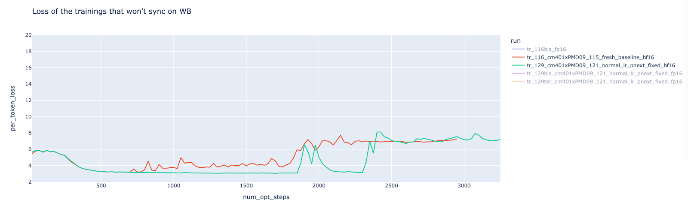
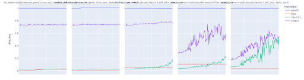
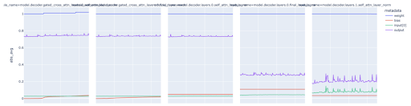
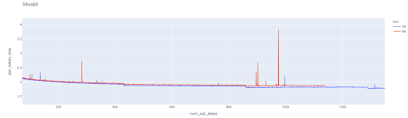

# Hugging Face Loss Divergences Learnings from Training Vision Language Model

#### Note: This is based on an internal note from hugging face team on what they have learned from training a VL model. The report only focused on the loss divergences learnings rather than sharing the model details (eg Num of Params).  

#### Hugging Face Team trained a vision-language model by combining pretrained backbones (Vision Encoder backbone and  Langauge Model backbone) with newly intialised parameters. The backbones were freezed and only the newly added parameters were trainined. Adding these parameters turned out to be a stability nightmares, as the team faced loss divergence when training in mixed precision bf16 at the an early stage of 2-3 billion scale. 

# MAIN CHALLENGE

### Activation and Gradient Explosions 

#### Many steps prior to encountering loss divergence, the team noticed a phenomenon characterized by the sudden surges in activations and gradients. These surges were closely linked to the occurrence of loss divergence. 

#### The impact of this phenomenon was most pronounced in the initial layers, particularly in the outer projection activations within the MLP block, as well as in the output (O) of the attention block. Interestingly, the components Q, K, and V did not exhibit significant susceptibility to these effects.

#### Activations Exploding (BF16 run)

#### Activations Exploding (FP16 run)

## SOLUTIONS THAT DID NOT WORK

### BF16
#### The team considered the possibility that starting with a bf16 adaptation, which involves fully fine-tuning a mixed precision fp16 trained language model exclusively for pure language modeling using mixed precision bf16, might be beneficial. While it did provide some improvement in terms of stability, it turned out to be unnecessary. In fact, it had a slightly adverse effect on performance, as the loss initially started at a higher level and eventually settled at a slightly elevated level.

### Heavier Weight Decay
#### The team applied heavier weight decay to prevent weights from becoming too large ("Prevent them from going far from zero"). Did not work, since the loss was still diverging

### Placing Tunable blocks
#### The newly intialised transfomer blocks are inserted between LM layers had no impact. The idea was to ensure that right after the embedding, we have a pretrained layer, and not newly addedc intialised parameters 

### LayerNorm After Outer Projections
#### Used layerNorm after outer projection (FC2 and out_proj) to stabilize activations values, it worked but the loss was still diverging.

### Hyperparameters Tuning
#### HP sweeps did not have impact (WarmUp Steps, Batch Size, z_loss weight and lr)

### Adam Optimizers Hyperparameters
#### beta1, beta2, eps, weight decay: close to no impact 

### Data Filtering
#### The team used Open Page Rank, to select web pages that ranked hihger, but this did not yield significant differences. 
#### This was only attempted with 2B scale, maybe with bigger model could have helped?

## SOLUTIONS THAT WORKED 

### LayerNorms on the Q and K projections
#### Adding layer normalization (LN(Q) AND LN(K)) to the Q and K projection as inspird by the Scaling VIT to 22B parameter paper. 
#### The team assumed that explosion of the output from Q and K was not a problem, since the softmax would bring them down to the range of 0 and 1. But this wasnt the case.
#### The team also tried L2 norm L2_NORM(Q) AND L2_NORM(K) and it yielded similar stabilisation to the LN but led to lower performance

### Unfreeze LayerNorm from the frozen LM backbone 
#### This helped the diverging models to recover, it helped, but the team demmed it as unnecessary. 

### RMSNorm
#### the team ditched the layerNorm and used RMSNorm, and turned out ot be benefial

### No biases in nn.Linear

### Keep Calm and Decrease LR
#### Lessons Learned: Bigger batch allows bigger LR which means faster loss descreases. Hyperparameters: WarmUp Steps, Batch Size, z_loss weight and lr

### Training Both VL Backbones is Important
#### OPT > GPT-NEO > GPT2 > BLOOM
#### Increasing the side of the vision encoder yeilds better performance out of the box. The Paper: PaLI: A Jointly-Scaled Multilingual Language-Image Model, suggest that you could even go bigger and still get better performance compared to increasing LM

## LEARNINGS

### Deep Models are Unstable
#### A shallow and wide LMs yeild less spiky training run, than deep and narrow  LMs. 
#### Would be Interesting to see also performance (Will try this with GPT2 style autoregressive and report back)

## BUGS/MISTAKES

### Not using shared env
#### Could not reproduce certain evaluation because the team used someone else conda env. LIBRARY VERSION IS IMPORTANT 

### Bugs
#### Create a lot of tests and have checks in your code (raise errors or assert)

