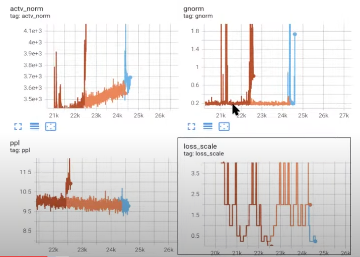
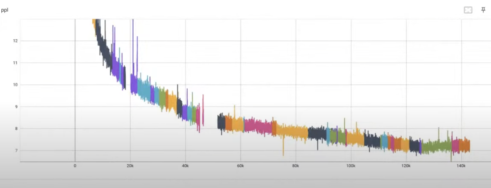

# Meta Numerical Instabilities Learnings from Training OPT model

# MAIN CHALLENGE
#### GradNorm/ActivationNorm Explode and Loss Scale divergence

## SOLUTIONS THAT DID NOT WORK

#### Weight Decay
##### The team increased weight decay to 0.1 from 0.01, loss plateaus

#### Adapting to GPT-3 /Megatron-LM Hyperparameters
##### * Set Grad Norm Clipping to 1.0
##### * reduced Adam beta2 from 0.98 to 0.95
##### * increased Adam epsilon from 1e-8 to 1e-6

#### Doubled Batch Size
##### * Using large batch size did not make much difference

#### Hyperparameters Tuning After Run 10 (Instabilities)
##### * Moved Weight Decay to 0.05
##### * Increased Learning Rate: [The team thought starting with high learning rate is okay, since you can drop it if things start to become unstable]
##### * No dropout on embeddings
##### * Normfomer: Gradients at early layers are much larges than at later stages: Adding three normalization operations to each layer. : https://arxiv.org/abs/2110.09456
##### * Gradient pre-divide factor: 32 
##### * Clip (l2-Norm): 2.5
##### * Learned postional embeddings with sinusoidal init.

#### Modified the Above Hyperparameter to Stabailise Training
##### * Lowered LR from 3e-4 -> 7.5e-5
##### * Lowered gradient clipping from 2.5 to 1.5 NB: clipping stabilised grad norm spikes training but at 4500 - 5500 steps
##### * Skipped Batches when grad norm is > 1.0

#### Inward NormFactor 
##### * if the Q and K dim are large, then the matmul between the two make the output to blow up, therefore the norm factor wont make a huge difference
##### * The team moved the norm factor inward: n * (A dot B) === (sqrt(n) * A) dot (sqrt(n) * B) # Suppose to improve numerical instabilities. 

#### Removed Gelu and Used Relu

#### Training with FP-16 (Not mixed precesion)
##### * To avoid overflow/underflow used loss scaing to preserve small gradients values
##### * reference to learn more about loss scaling: https://www.graphcore.ai/posts/training-large-models-more-stably-with-automatic-loss-scaling

#### Hyperparameters Tuning After Run 11 (Instabilities): 
#### Since the above hyperparameters, did not work, the team decided to:
##### * Remove extra layer norms from NormFormer setup
##### * weight decay to 1.0
##### * clipping 1.0
##### * max lr of 1.2e-4
##### * adam beta2 = 0.95
##### * removed embedding scalings
##### * Gaussian init for learned positional embeddings (instead of sinu-init)

## SOLUTIONS THAT WORKED

### LOWERING LEARNING RATE IS ALL YOU NEED
##### * The team monitored their loss metrics closely, and when they see a little bit of divergence, they lowered their learning rate. 

### Clipping
##### * Not a clear cut if lowering clipping from 1.0 to 0.3 helped or it just delayed the spikes?

### Where to Restart?
##### * In some cases the team had to roll back quite significantly, to avoid the spikes.

### BF-16 
##### * Using BF-16 helped a lot to overcome the numerical instabilities the team faced. 

# LEARNINGS
##### Spend time on data, and data quality.
##### Start small and scale, starting small enable you to avoid sotly mistakes as well see what works and what does not work.

# BUG/MISTAKES
#### Data Artifacts: Added extract escape characters in the deduplication pipeline. The loss ws decreasing only to find out it was predicting escape characters.  
#### Weight decay bug in Run 12. 
#### Tensor parallel implementation
###### small model (125m) failed to converge with tensor parallel code

### System Issues
#### Cuda Errors, NCCL errors, Lost GPU, Job Slowdown, Blob storage